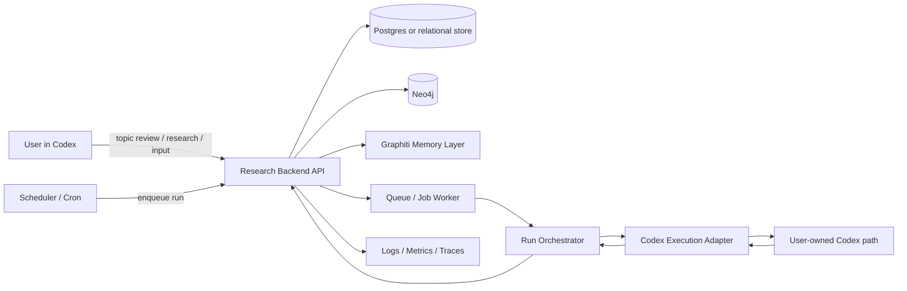
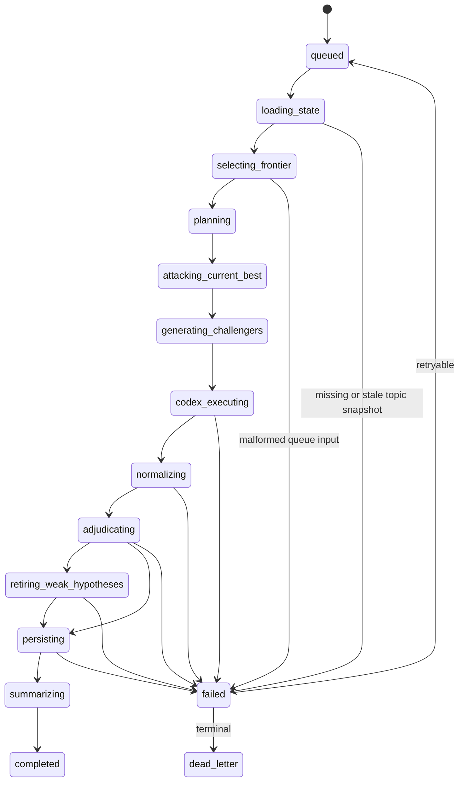
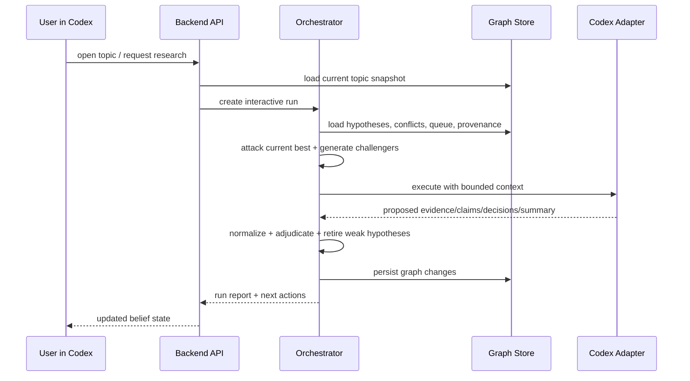
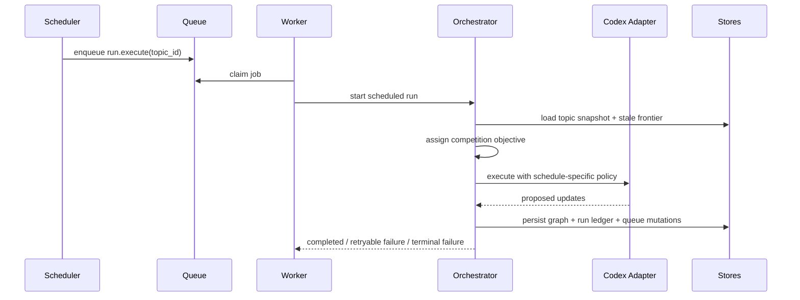

# Continual Research Bot ARCH

## 1. Document Goal

이 문서는 `SPEC.md`를 실제 구현 가능한 수준으로 구체화한 v1 아키텍처 문서다.
핵심 목적은 아래 두 가지다.

- 구현자가 바로 다음 구현 이슈를 분해할 수 있게 한다.
- `Only Codex` 제약 아래에서도 backend가 state authority를 유지하도록 경계를 명확히 한다.

본 문서는 `v1 기준 설계 결정`, `명시적 가정`, `실행 흐름`, `저장 경계`, `실패 복구 경계`를 함께 다룬다.

상세 후속 설계는 아래 문서로 분리한다.

- `RUNTIME.md`: Codex adapter runtime loop, tool registry, output repair, compaction, resume
- `AUTH_AND_EXECUTION.md`: user-owned Codex auth/session lifecycle, trusted runner boundary, scheduled execution

## 2. Architecture Summary

한 줄 요약:

`Codex-centered UX + Python backend harness + Neo4j/Graphiti memory layer + backend-owned queue/scheduler/provenance`

핵심 원칙:

- Codex는 `research execution engine`이자 사용자 접점이다.
- backend는 `topic state`, `queue`, `scheduler`, `provenance`, `revision authority`를 소유한다.
- graph의 핵심 판단 단위는 fact가 아니라 `hypothesis`다.
- 아키텍처의 목표는 hypothesis를 누적 보관하는 것이 아니라 `competition loop`와 `selection pressure`를 유지하는 것이다.
- 모든 run은 `user-visible summary`와 `backend-owned state update`를 동시에 남겨야 한다.
- Codex 세션은 장기 상태 저장소가 아니므로, 모든 재실행은 backend snapshot에서 복원 가능해야 한다.

## 3. Scope And Non-Scope

### 3.1 v1 In Scope

- topic 생성 및 상태 조회
- interactive run
- scheduled run
- user input ingestion and queueing
- evidence, claim, hypothesis, conflict, decision 저장
- provenance 및 revision history 저장
- Codex execution adapter
- run replay를 위한 idempotent backend workflow

### 3.2 v1 Out Of Scope

- 완전 자율 멀티에이전트 swarm
- 모든 데이터 소스 전용 adapter
- backend가 없는 Codex-only persistence
- 완전 자동 truth resolution
- 고도화된 model routing 계층

## 4. System Context



컨텍스트 설명:

- 사용자는 Codex에서 topic 상태 확인, 즉시 연구 실행, 의견 입력을 수행한다.
- scheduler는 topic frontier와 stale 상태를 기준으로 run을 생성하며, 반복 실행이 competition pressure를 잃지 않도록 자극한다.
- backend는 run 계획, queue 소비, graph update, provenance persistence를 담당한다.
- Codex adapter는 backend 내부의 하위 모듈이며, state authority를 가지지 않는다.

## 4.1 Hypothesis Competition Loop

아키텍처 수준에서 모든 run은 아래 경쟁 루프의 일부여야 한다.

1. current best hypothesis를 불러온다.
2. 현재 가설을 공격하거나 대체할 challenger hypothesis를 생성한다.
3. support evidence와 challenge evidence를 모두 수집한다.
4. adversarial verification과 reconciliation을 수행한다.
5. 약한 hypothesis를 weaken, supersede, retire 중 하나로 정리한다.
6. 남은 unresolved conflict를 다음 frontier로 되돌린다.

이 루프가 없다면 repeated run은 검색 반복일 뿐이며,
아키텍처 목표인 belief improvement를 보장하지 못한다.

## 5. Primary Modules

### 5.1 API / Application Layer

역할:

- topic read API
- run trigger API
- user input submit API
- run report 조회 API
- human review or override API

대표 책임:

- 요청 인증 및 권한 확인
- topic snapshot 조회
- queue item 생성
- run 상태 전이 노출

### 5.2 Research Orchestrator

역할:

- run lifecycle 관리
- frontier selection
- strategy allocation
- hypothesis competition loop 조율
- Codex adapter 호출
- 결과 validation 및 graph write transaction 조율

대표 책임:

- `run_started`, `evidence_acquired`, `revision_applied`, `run_completed`, `run_failed` 같은 내부 상태 전이 관리
- 단계별 idempotency key 부여
- 실패 시 재시도 정책 적용
- 매 run이 최소 `current best hypothesis attack`, `challenger generation`, `adversarial verification`, `reconciliation`, `weak hypothesis retirement` 중 일부를 실제로 수행했는지 기록

### 5.3 Codex Execution Adapter

역할:

- backend가 Codex를 호출하기 위한 단일 진입점
- interactive / scheduled 실행 모두 동일한 contract로 감싼다

상세 설계 위치:

- runtime loop / tool dispatch / output repair: `RUNTIME.md`
- OAuth bootstrap / session lease / scheduled execution: `AUTH_AND_EXECUTION.md`

입력:

- topic brief
- current hypothesis state
- queue items
- research plan
- tool/network constraints
- output schema 요구사항

출력:

- evidence candidates
- extracted claims
- arguments
- adjudication suggestions
- draft run summary
- next actions

주의:

- adapter는 graph를 직접 authoritative하게 수정하지 않는다.
- adapter 출력은 `proposed state change`이며, 최종 반영은 backend adjudication/persistence layer가 수행한다.
- adapter는 auth authority도 아니다. user credential lifecycle은 별도 session manager가 소유한다.

### 5.4 Queue / Worker Layer

역할:

- interactive run과 scheduled run을 동일한 job contract로 실행
- retry, dead-letter, backoff 관리

권장 job 유형:

- `topic.bootstrap`
- `run.execute`
- `run.resume`
- `user_input.process`
- `topic.refresh_schedule`
- `graph.repair`

### 5.5 Scheduler

역할:

- stale topic 탐지
- 높은 uncertainty topic 재실행
- user input backlog 처리 우선순위 조정
- competition pressure가 낮아진 topic 재가열

스케줄 기준 예시:

- 마지막 run 이후 경과 시간
- unresolved conflict 수
- open question 수
- 최신 evidence freshness
- user input 적체량
- new challenger hypothesis rate
- source diversity delta
- support vs challenge ratio
- hypothesis revision / retirement rate

설계 원칙:

- scheduler는 단순 refresh 타이머가 아니라 competition pressure 유지 장치다.
- frontier selection은 "무엇을 다시 볼까"보다 "어떤 가설을 다시 공격할까"를 우선해야 한다.
- strategy allocation은 익숙한 hypothesis를 반복 확인하는 대신 challenge가 부족한 지점을 우선 배정해야 한다.

### 5.6 State Store

권장 저장 분리:

- relational store: run metadata, queue metadata, idempotency ledger, auth/session metadata, configuration
- graph store: topic graph, epistemic graph, provenance graph

권장 이유:

- graph DB는 관계 탐색에 강하지만 job/state machine bookkeeping의 단일 저장소로 쓰기엔 불리하다.
- run coordination과 retry bookkeeping은 관계형 모델이 더 안정적이다.

## 6. Data Ownership Model

### 6.1 Backend-Owned Source Of Truth

backend가 authoritative하게 소유해야 하는 것:

- topic metadata
- run ledger
- queue state
- revision decisions
- provenance records
- retry state
- idempotency keys
- scheduler policy
- Codex adapter configuration

### 6.2 Codex-Owned Temporary Context

Codex가 일시적으로만 보유하는 것:

- 현재 실행 프롬프트 컨텍스트
- 임시 reasoning chain
- 검색 과정의 working set
- 초안 수준의 evidence/claim/hypothesis 제안

### 6.3 Why This Split Is Mandatory

- Codex cloud는 task 단위 sandbox 환경이며 장기 daemon/state authority가 아니다.
- OpenAI 문서도 Codex cloud가 task별 sandboxed container에서 동작한다고 설명한다.
- OpenAI의 shell/tooling 문서는 임의 명령 실행이 위험하므로 sandbox와 allowlist가 필요하다고 명시한다.
- 따라서 장기 research state는 Codex 세션이나 작업 로그에 의존하지 않고 backend 저장소에 고정되어야 한다.

## 7. Graph Architecture

### 7.1 Layer Split

본 시스템은 `3-layer research graph`를 실제 저장 경계로 구체화한다.

### Layer A: World Representation Graph

노드 예시:

- `Entity`
- `Event`
- `SourceDocument`
- `TimeWindow`
- `AttributeAssertion`

관계 예시:

- `MENTIONS`
- `RELATES_TO`
- `OCCURRED_AT`
- `HAS_ATTRIBUTE`

용도:

- 검색 결과 정규화
- temporal traversal
- 동일 entity/entity alias 병합 보조

### Layer B: Epistemic Graph

노드 예시:

- `Claim`
- `Hypothesis`
- `Question`
- `Argument`
- `ConflictCase`
- `Decision`
- `UserInput`

관계 예시:

- `SUPPORTS`
- `CHALLENGES`
- `WEAKENS`
- `ALTERNATIVE_TO`
- `SUPERSEDES`
- `TARGETS`
- `TRIGGERS`

용도:

- 현재 belief state 표현
- competing hypothesis 관리
- uncertainty frontier 계산

### Layer C: Provenance / Process Graph

노드 예시:

- `Run`
- `Extraction`
- `ToolCall`
- `PromptTemplate`
- `JudgeDecision`
- `QueueItem`
- `RevisionRecord`

관계 예시:

- `GENERATED_IN`
- `DERIVED_FROM`
- `USED_PROMPT`
- `TRIGGERED_BY`
- `PERSISTED_AS`

용도:

- 왜 이런 판단을 했는지 설명 가능성 제공
- 재실행 경계와 human audit 지원

### 7.2 Neo4j vs Graphiti Responsibility Split

권장 원칙:

- `Neo4j`는 canonical graph persistence와 application query layer를 담당한다.
- `Graphiti`는 temporal/incremental ingestion, episode lineage, hybrid retrieval 보조 계층으로 사용한다.

구체적 분리:

- Neo4j:
  - 최종 canonical node/edge 저장
  - application-owned schema와 제약조건
  - hypothesis-centric query API
  - revision history 조회
- Graphiti:
  - episode ingestion
  - temporal fact invalidation 보조
  - provenance-linked memory retrieval
  - hybrid search/recall 보조

중요한 결정:

- Graphiti를 곧바로 제품의 최종 epistemic authority로 두지 않는다.
- Graphiti 출력은 canonicalizer를 거쳐 Neo4j schema로 정규화한다.

이유:

- Graphiti 공식 문서는 episodes, temporal fact management, provenance lineage, hybrid retrieval에 강점을 둔다.
- 하지만 제품의 핵심은 hypothesis lifecycle과 revision policy이며, 이는 application-specific rule과 state machine이 직접 소유해야 한다.

### 7.3 Canonicalization Boundary

`Codex/Graphiti output -> canonicalizer -> Neo4j write`

canonicalizer 책임:

- 중복 entity 후보 병합
- temporal scope normalization
- claim text normalization
- hypothesis versioning
- edge type validation
- schema compatibility check

competition 관련 추가 책임:

- challenger hypothesis를 기존 best hypothesis와 명시적으로 연결
- support-only 갱신이 반복될 때 stagnation 후보로 태깅
- weak hypothesis retirement 후보를 revision engine에 전달

## 8. Relational Data Model

관계형 저장소에 최소 필요한 테이블:

- `topics`
- `runs`
- `run_steps`
- `queue_items`
- `user_inputs`
- `idempotency_keys`
- `codex_sessions`
- `scheduler_policies`
- `run_artifacts`

핵심 컬럼 예시:

- `topics`
  - `id`
  - `slug`
  - `status`
  - `last_run_at`
  - `frontier_score`
- `runs`
  - `id`
  - `topic_id`
  - `run_type` (`interactive` | `scheduled`)
  - `status`
  - `attempt_count`
  - `trigger_source`
  - `started_at`
  - `completed_at`
- `queue_items`
  - `id`
  - `topic_id`
  - `kind`
  - `priority`
  - `status`
  - `dedupe_key`
  - `scheduled_for`
- `idempotency_keys`
  - `scope`
  - `scope_id`
  - `operation`
  - `key`
  - `result_ref`

## 9. Run State Machine



상태 정의:

- `queued`: 실행 대기
- `loading_state`: topic snapshot과 queue 입력 복원
- `selecting_frontier`: 이번 run의 불확실성 목표 결정
- `planning`: strategy와 Codex prompt payload 구성
- `attacking_current_best`: 현재 best hypothesis의 취약점과 반증 가능성을 명시
- `generating_challengers`: 대안 가설과 counter-position 생성
- `codex_executing`: evidence/claim/hypothesis proposal 생성
- `normalizing`: schema validation과 dedupe
- `adjudicating`: conflict taxonomy 적용 및 revision decision 결정
- `retiring_weak_hypotheses`: 약화, 대체, 폐기 대상 hypothesis 정리
- `persisting`: graph write, ledger write, queue mutation commit
- `summarizing`: 사용자용 run summary와 next action 생성

## 10. Interactive Run Sequence



interactive run 특징:

- 사용자가 즉시 결과를 본다.
- queue item 없이도 직접 run을 생성할 수 있다.
- 긴 실행은 background run으로 전환 가능해야 한다.
- 단순 업데이트 확인이 아니라 current best hypothesis를 직접 흔들 수 있어야 한다.

## 11. Scheduled Run Sequence



scheduled run 특징:

- Codex 세션/인증 상태가 끊겨도 backend ledger는 살아 있어야 한다.
- 동일 topic에 대해 동시 scheduled run은 기본적으로 직렬화한다.
- scheduler는 challenge가 부족한 topic에 선택 압력을 다시 가해야 한다.

## 12. User Input To Queue Flow

사용자 입력 유형:

- `candidate_hypothesis`
- `counterargument`
- `research_lead`

처리 흐름:

1. Codex에서 user input 제출
2. backend가 `user_inputs`와 provenance record 저장
3. classifier가 queue kind 결정
4. dedupe key 계산
5. 관련 topic frontier score 조정
6. `user_input.process` 또는 `run.execute` queue item 생성

중요 규칙:

- user input은 truth로 곧바로 승격되지 않는다.
- 모든 입력은 검증 대상으로만 들어간다.

## 13. Codex Adapter Contract

### 13.1 Input Envelope

adapter 입력은 최소 아래 구조를 가져야 한다.

- `topic_summary`
- `current_best_hypotheses`
- `challenger_targets`
- `active_conflicts`
- `open_questions`
- `recent_provenance_digest`
- `selected_queue_items`
- `run_objective`
- `tool_constraints`
- `output_schema`

### 13.2 Output Envelope

adapter 출력은 최소 아래 구조를 가져야 한다.

- `evidence_candidates[]`
- `claims[]`
- `arguments[]`
- `challenger_hypotheses[]`
- `conflict_assessments[]`
- `revision_proposals[]`
- `summary_draft`
- `next_actions[]`
- `execution_meta`

### 13.3 Guardrails

- 자유 텍스트만 받지 않고 구조화된 JSON schema를 우선한다.
- evidence마다 source URL, accessed_at, extraction note를 요구한다.
- unsupported field가 있으면 normalization 단계에서 reject 또는 quarantine 한다.

## 14. Auth, Session, And Execution Constraints

### 14.1 Only Codex Reality

이 설계의 핵심 제약은 `no extra API token required`다.
따라서 backend는 Codex를 일반적인 stable API dependency처럼 가정하면 안 된다.

아키텍처 반영 사항:

- Codex adapter는 session bootstrap과 renewal 훅을 가진다.
- session 상태는 run과 분리된 별도 ledger에 저장한다.
- session unavailable 시 scheduled run은 `deferred` 또는 `retryable_failed`로 떨어진다.
- topic state는 언제나 session 외부 저장소에서 복원 가능해야 한다.

### 14.2 Security Boundary

OpenAI 문서 기준으로 shell 실행은 sandbox/allowlist가 필요하고, Codex cloud의 agent internet access는 기본적으로 막혀 있으며 필요 시 환경별 allowlist를 설정한다.

이 아키텍처의 보안 원칙:

- default network policy는 최소 권한
- source allowlist 기반 retrieval
- raw secret은 Codex prompt에 직접 주입하지 않음
- tool execution policy는 environment 단위로 관리
- 외부 web content는 provenance와 trust tier를 함께 저장

### 14.3 Headless Scheduled Execution Assumption

명시적 가정:

- v1 scheduled execution은 `user-owned Codex path`를 자동화 가능한 형태로 감싼다는 전제 위에 선다.
- 이 전제가 실제 운영 환경에서 불안정하면, fallback으로 human-approved batch execution 또는 future API/SDK path를 검토해야 한다.

이 가정은 현실 제약이므로 `ARCH.md`에서 숨기지 않고 운영 리스크로 노출한다.

## 15. Retry And Idempotency Boundaries

### 15.1 Boundary Rules

idempotency key를 최소 아래 단계에 둔다.

- run creation
- queue dequeue/claim
- Codex execution request
- normalization result persistence
- graph write batch
- summary artifact persistence
- queue mutation commit

### 15.2 Write Strategy

권장 전략:

- graph write 전까지는 `proposed_artifact`로 저장
- graph write와 run ledger 완료를 하나의 application transaction boundary로 묶음
- summary generation은 graph write 이후 재실행 가능하도록 분리

### 15.3 Failure Classes

- `transient_external`
  - session expiry
  - Codex unavailable
  - temporary network failure
- `deterministic_input`
  - invalid schema
  - unsupported source
  - canonicalization failure
- `consistency_failure`
  - graph uniqueness violation
  - duplicate revision application
  - queue mutation mismatch

처리 원칙:

- transient는 retry
- deterministic input은 quarantine
- consistency failure는 human review 또는 repair job

## 16. Observability

필수 로그 단위:

- run lifecycle log
- Codex adapter request/response metadata
- canonicalization decision log
- revision decision log
- graph write batch log
- queue mutation log

필수 메트릭:

- run success rate
- run latency by stage
- retry count
- stale topic count
- unresolved conflict count
- hypothesis supersession rate
- new challenger hypothesis rate
- source diversity delta
- support vs challenge ratio
- hypothesis revision / retirement rate
- queue backlog depth
- Codex session failure rate

필수 trace/span:

- `run.load_state`
- `run.select_frontier`
- `run.codex_execute`
- `run.normalize`
- `run.adjudicate`
- `run.persist`
- `run.summarize`

## 17. Suggested Repository / Process Layout

```text
backend/
  app/
    api/
    services/
    orchestrator/
    codex_adapter/
    canonicalizer/
    revision/
    scheduler/
    workers/
    persistence/
    observability/
  tests/
  migrations/
infra/
docs/
  SPEC.md
  ARCH.md
```

모듈 책임:

- `api/`: request/response contract
- `orchestrator/`: run state machine
- `codex_adapter/`: Codex path abstraction
- `canonicalizer/`: schema normalization and dedupe
- `revision/`: conflict taxonomy and revision decisions
- `persistence/`: graph + relational repository abstraction
- `workers/`: queue consumer entrypoints

## 18. Implementation Slice Plan

권장 구현 순서:

1. relational schema와 graph schema 초안 정의
2. topic snapshot read model 정의
3. run state machine 및 queue contract 구현
4. Codex adapter interface와 mock adapter 구현
5. canonicalizer 및 validation 계층 구현
6. revision engine 최소 규칙 구현
7. interactive run end-to-end 경로 구현
8. scheduled run worker 구현
9. observability와 repair job 추가

각 단계의 완료 산출물:

1. schema 문서와 migration
2. topic load API
3. retry 가능한 worker
4. structured adapter I/O contract
5. invalid output quarantine
6. revision record persistence
7. user-visible run report
8. scheduler-driven automation
9. 운영 대시보드/alerts

## 19. Open Questions

- scheduled Codex execution을 어떤 런타임 경로로 감쌀 것인가: CLI automation, cloud task bridge, human-approved relay 중 무엇이 가장 안정적인가
- Graphiti를 별도 서비스로 둘 것인가, backend 프로세스 내부 라이브러리로 둘 것인가
- canonical graph write를 Neo4j 단일 DB에 둘 것인가, topic별 namespace 전략을 둘 것인가
- revision engine의 rule-based baseline과 LLM-assisted adjudication 비율을 어디까지 둘 것인가
- user-visible run summary 포맷을 markdown 중심으로 할지 structured card 중심으로 할지

## 20. Explicit Assumptions

- v1 backend runtime은 `Python`이다.
- canonical graph DB는 `Neo4j`다.
- Graphiti는 temporal memory helper이며 제품 state authority가 아니다.
- Codex adapter는 structured output을 안정적으로 요구할 수 있다고 가정한다.
- scheduled execution의 인증 및 세션 갱신은 application-owned automation으로 처리한다고 가정한다.
- v1에서는 topic별 concurrent write를 제한하는 것이 더 안전하다.

## 21. Operational Risks

- Codex execution path 안정성이 일반 API보다 낮을 수 있다.
- headless scheduled execution은 인증/세션 수명에 운영 리스크가 있다.
- Graphiti와 application schema가 분리되면 canonicalization complexity가 증가한다.
- temporal conflict taxonomy 품질이 낮으면 hypothesis revision 품질도 급격히 떨어진다.
- repeated runs with no real competition이 발생하면 belief quality가 정체될 수 있다.

대응:

- adapter abstraction 유지
- run artifact 전단계 저장
- repair/replay job 제공
- human escalation path 명시
- stagnation 감지 메트릭을 scheduler 입력과 운영 알림에 연결

## 22. References

- [`SPEC.md`](./SPEC.md)
- OpenAI Developers, Codex web overview: <https://developers.openai.com/codex/cloud>
- OpenAI Developers, agent internet access: <https://developers.openai.com/codex/cloud/internet-access>
- OpenAI API docs, shell guidance: <https://platform.openai.com/docs/guides/tools-shell>
- OpenAI API docs, local shell guidance: <https://platform.openai.com/docs/guides/tools-local-shell>
- OpenAI Developers, Docs MCP: <https://developers.openai.com/learn/docs-mcp>
- Graphiti official repository README: <https://github.com/getzep/graphiti>
