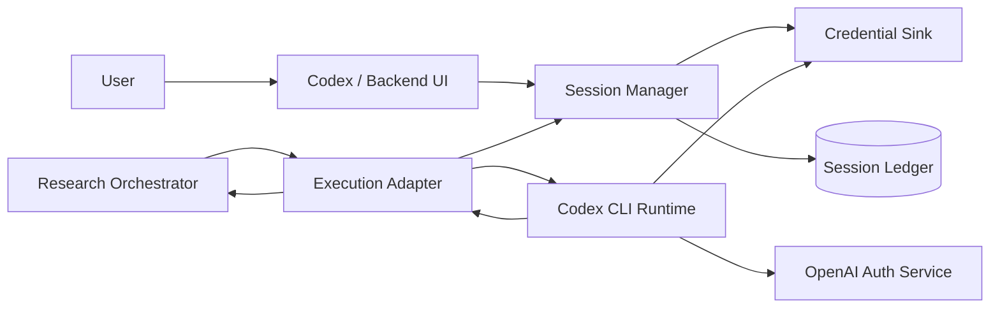
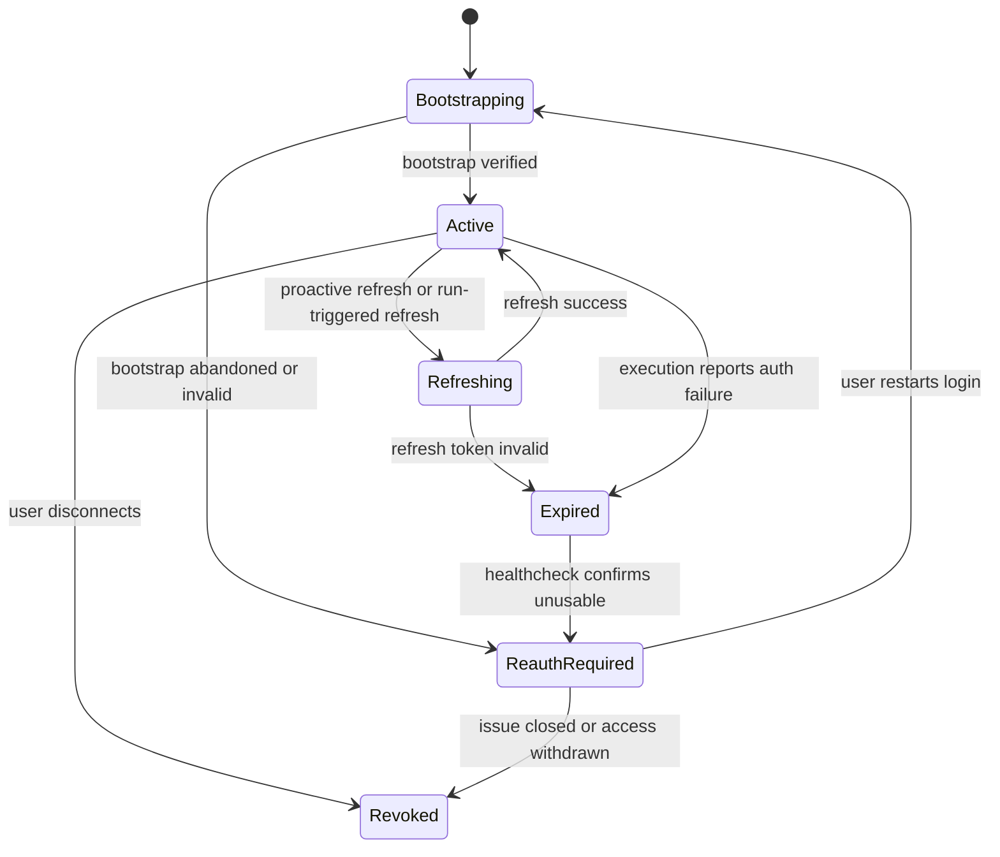
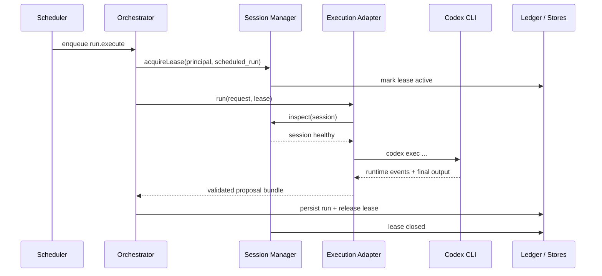

# Continual Research Bot Auth And Execution Design

## 1. Goal

`AUTH_AND_EXECUTION.md`는 `DEE-12`의 두 번째 축인 `user-owned Codex Max plan OAuth execution architecture`를 구현 가능한 수준으로 닫는 문서다.

핵심 질문은 하나다.

`사용자 소유 ChatGPT/Codex access를 backend가 어떻게 안전하게 사용하면서 interactive run과 scheduled run을 모두 지원할 것인가`

본 문서는 다음을 정의한다.

- auth/session bootstrap flow
- refresh / renewal lifecycle
- headless scheduled execution 경로
- session expiry / re-auth recovery
- user credential isolation
- local vs hosted runtime boundary
- Codex adapter contract와 provider/session abstraction
- session ledger schema

## 2. External Constraints

OpenAI 공식 문서에서 확인되는 제약:

- Codex는 ChatGPT sign-in 또는 API key sign-in을 지원한다.
- Codex cloud는 ChatGPT sign-in이 필요하다.
- CLI/IDE는 ChatGPT 또는 API key 모두 가능하다.
- active ChatGPT sign-in session은 local cache를 재사용하며, active use 중에는 토큰 refresh가 자동으로 수행된다.
- headless 환경에서는 `codex login --device-auth` 또는 trusted-machine에서 생성한 `~/.codex/auth.json` 복사가 fallback으로 제시된다.
- automation에서는 API key가 권장 기본값이지만, trusted runner에서는 ChatGPT-managed auth도 가능하다.

이 문서의 설계 판단:

- v1 제품 thesis가 `user-owned Codex Max plan path`를 전제로 하므로, `trusted runner + ChatGPT-managed auth` 경로를 설계의 중심으로 둔다.
- 다만 공식 문서가 automation의 기본 경로로는 API key를 권장하므로, scheduled execution은 `trusted/private runtime only`로 제한해야 한다.

## 3. Operating Modes

### 3.1 Supported Modes

| Mode | Primary auth | Runtime location | Purpose |
| --- | --- | --- | --- |
| interactive-local | ChatGPT OAuth | user-owned machine | Codex UI initiated research |
| scheduled-trusted-runner | ChatGPT OAuth | private trusted host | periodic reruns using user-owned session |
| emergency-api-fallback | API key | private trusted host | break-glass operator path, not default product path |

### 3.2 Unsupported Modes In v1

- public CI runners using user ChatGPT auth
- shared multi-tenant hosted execution with cross-user session reuse
- backend-owned master OAuth account serving multiple users
- any design that copies raw user credentials into application database

## 4. Design Thesis

한 줄 요약:

`The backend never becomes the identity authority; it only leases a user-approved Codex execution session through a narrow adapter contract and records enough metadata to recover safely.`

핵심 원칙:

- user principal과 backend execution principal은 항상 1:1로 연결된다.
- raw OAuth material은 가능하면 OS credential store 또는 isolated secret volume에만 저장한다.
- relational DB에는 raw token 대신 `session ledger metadata`만 저장한다.
- scheduled execution은 `consent + trusted host + renewable session`이 모두 만족할 때만 허용한다.
- auth refresh는 runtime concern이 아니라 별도 `session manager` concern이다.

## 5. High-Level Architecture



구성 요소:

- `Session Manager`: bootstrap, refresh, health check, renewal orchestration
- `Credential Sink`: `~/.codex/auth.json` 또는 keyring-backed isolated storage
- `Session Ledger`: DB에 저장되는 metadata와 lease 상태
- `Execution Adapter`: run 시점에 특정 principal session을 attach
- `Codex CLI Runtime`: 실제 Codex execution surface

### 5.1 Verification Surfaces

principal/workspace/session verification은 단일 파일이나 단일 명령으로 닫히지 않는다.
v1은 아래 세 가지 신호를 조합한다.

| Purpose | Primary source | Why |
| --- | --- | --- |
| principal 확인 | loopback `codex app-server`의 `account/read` | `email`, `type`, `planType`, `requiresOpenaiAuth`를 공식 schema로 확인 가능 |
| workspace restriction 확인 | `config/read` 또는 session 전용 `config.toml` | `forced_login_method`, `forced_chatgpt_workspace_id`, project trust policy는 config가 authority다 |
| session continuity 확인 | `~/.codex/auth.json`, `codex login status` | `auth_mode`, `last_refresh`, token presence, ChatGPT login 상태를 확인 가능 |

핵심 판단:

- `auth.json`만으로는 principal을 새로 증명할 수 없다.
- `auth.json`은 continuity signal이지 identity proof가 아니다.
- principal fingerprint는 bootstrap 시점에 `account/read`로 먼저 확정하고, 이후 `auth.json`은 그 fingerprint가 유지되는 session인지 확인하는 보조 신호로만 쓴다.

## 6. Principal And Session Model

### 6.1 Principal Types

- `user_principal`: 실제 ChatGPT/Codex plan 소유자
- `runtime_principal`: 특정 trusted host에서 해당 user principal을 대신해 Codex를 실행하는 identity binding
- `operator_principal`: 시스템 운영자. user session을 임의 대체할 권한이 없다.

### 6.2 Session Types

- `interactive_session`: 사용자가 직접 login을 시작한 session
- `leased_execution_session`: interactive bootstrap 이후 scheduler가 재사용하는 session
- `renewal_session`: re-auth 또는 device-auth 복구 중인 임시 상태
- `revoked_session`: 더 이상 실행에 사용 불가한 상태

### 6.3 Principal Fingerprint

v1 principal fingerprint는 아래 canonical string의 SHA-256으로 정의한다.

```text
lowercase(account.email) + "|" + account.type + "|" + (forced_chatgpt_workspace_id or "-")
```

여기서:

- `account.email`, `account.type`은 `account/read` 응답에서 읽는다.
- `forced_chatgpt_workspace_id`는 app-server `config/read` 또는 session 전용 `config.toml`에서 읽는다.
- `planType`은 audit metadata로 저장하지만 identity key에는 넣지 않는다. plan 변경이 principal mismatch로 오인되면 안 되기 때문이다.

결과적으로:

- ChatGPT principal mismatch는 `email` 또는 configured workspace restriction이 달라질 때 발생한다.
- same-user plan 변경은 mismatch가 아니라 metadata update다.

## 7. Adapter Contracts

### 7.1 Auth Provider Contract

```text
AuthProvider.beginBootstrap(principal_id, mode) -> BootstrapChallenge
AuthProvider.completeBootstrap(challenge_id, proof) -> SessionMaterialHandle
AuthProvider.refresh(session_handle) -> RefreshResult
AuthProvider.inspect(session_handle) -> SessionHealth
AuthProvider.revoke(session_handle) -> void
```

### 7.2 Execution Provider Contract

```text
ExecutionProvider.acquireLease(principal_id, purpose, ttl) -> ExecutionLease
ExecutionProvider.run(request, lease) -> RuntimeResult
ExecutionProvider.releaseLease(lease_id, outcome) -> void
ExecutionProvider.healthcheck(lease_id) -> LeaseHealth
```

### 7.3 Why Two Contracts

- auth bootstrap/refresh와 run execution은 lifecycle이 다르다.
- future provider abstraction에서 `Codex CLI`, `Codex app server`, `OpenClaw-like bridge`를 같은 execution interface로 묶기 쉽다.
- session refresh failure가 runtime implementation과 강하게 결합되는 것을 막는다.

## 8. Bootstrap Flow

### 8.1 Interactive Bootstrap

정상 경로:

1. 사용자가 backend에서 `Enable scheduled research with my Codex account`를 승인한다.
2. backend는 `Session Manager.beginBootstrap` 호출 후 local trusted host에 bootstrap intent를 생성한다.
3. trusted host에서 `codex login` 또는 headless면 `codex login --device-auth`를 수행한다.
4. Codex CLI가 OpenAI login flow를 완료하고 local credential sink를 갱신한다.
5. `Session Manager.inspect`가 credential presence, workspace restriction, principal fingerprint를 기록한다.
6. session ledger에 `active` 상태와 host binding이 생성된다.

### 8.2 Headless Bootstrap Fallback

공식 문서가 허용하는 fallback을 제품 정책으로 좁게 해석하면 아래와 같다.

1. browser 가능한 trusted machine에서 `codex login` 수행
2. file-based credential storage가 설정된 경우 `~/.codex/auth.json` 확보
3. secure copy로 trusted runner의 isolated secret volume에 전달
4. first healthcheck run을 통해 refresh 가능 여부 확인
5. session ledger를 `active`로 승격

주의:

- 이 경로는 private trusted host에서만 허용한다.
- auth.json은 password 수준의 secret으로 취급한다.
- application DB나 general blob store에 저장하지 않는다.
- copied `auth.json`만으로는 새로운 principal verification을 완료한 것으로 간주하지 않는다.
- copied `auth.json`은 기존에 검증된 session fingerprint를 이어받는 continuity recovery로만 허용한다.

## 9. Session Ledger Schema

DB에는 raw token이 아니라 아래 metadata만 저장한다.

| Field | Type | Notes |
| --- | --- | --- |
| `session_id` | uuid | internal stable id |
| `principal_id` | uuid | user principal reference |
| `provider` | text | `openai-codex-chatgpt` |
| `host_id` | text | trusted runtime host |
| `credential_locator` | text | secret path or keyring locator |
| `state` | text | `bootstrapping`, `active`, `refreshing`, `expired`, `reauth_required`, `revoked` |
| `workspace_id` | text nullable | expected ChatGPT workspace restriction from config, not inferred from `auth.json` |
| `workspace_root` | text | absolute repo/worktree root this session is allowed to run against |
| `account_fingerprint` | text | `sha256(lower(email)|type|workspace_id_or_dash)` |
| `plan_type` | text nullable | audit metadata from `account/read` |
| `verification_level` | text | `account-read+config-read` or `auth-json-continuity-only` |
| `last_validated_at` | timestamptz | last successful inspect |
| `last_refreshed_at` | timestamptz nullable | best effort metadata |
| `lease_count` | int | concurrent lease guard |
| `last_failure_code` | text nullable | auth / transport / policy |
| `last_failure_at` | timestamptz nullable | recovery orchestration |
| `reauth_url` | text nullable | bootstrap challenge pointer if pending |
| `created_at` | timestamptz | audit |
| `updated_at` | timestamptz | audit |

보조 테이블:

- `session_leases`
- `session_events`
- `session_host_bindings`

## 10. Verification Mechanism

### 10.1 Source Of Truth Per Check

각 검증 항목의 authoritative source는 아래와 같다.

| Check | Source | Accept / reject rule |
| --- | --- | --- |
| login method | `codex login status`, `auth.json.auth_mode`, config `forced_login_method` | `chatgpt`가 아니면 reject |
| principal identity | app-server `account/read.account.email` + `type` | fingerprint mismatch면 reject |
| workspace restriction | config `forced_chatgpt_workspace_id` | expected value와 다르거나 missing인데 required면 reject |
| workspace root | session ledger `workspace_root`, local `config.toml [projects.\"<abs_path>\"]`, runtime `cwd` | exact absolute path mismatch면 reject |
| session freshness | `auth.json.last_refresh`, token presence, run-start healthcheck | stale or missing refresh metadata면 reauth 또는 refresh path |

### 10.2 Concrete Inspect Algorithm

`SessionManager.inspect(session_handle)`는 아래 순서를 강제한다.

1. `codex login status`가 `Logged in using ChatGPT`를 반환하는지 확인한다.
2. `auth.json`을 읽어 `auth_mode == "chatgpt"`, `last_refresh != null`, `tokens.access_token`, `tokens.id_token`, `tokens.refresh_token` 존재 여부를 확인한다.
3. loopback `codex app-server`를 띄우고 `account/read`를 호출해 `{ account.email, account.type, planType, requiresOpenaiAuth }`를 읽는다.
4. same app-server connection에서 `config/read`를 호출해 `forced_login_method`, `forced_chatgpt_workspace_id`를 읽는다.
5. session ledger의 expected fingerprint와 `sha256(lower(email)|type|workspace_id_or_dash)`를 비교한다.
6. ledger의 `workspace_root`와 실제 실행하려는 absolute `cwd`가 일치하는지 확인한다.
7. session 전용 `config.toml`에서 `[projects."<workspace_root>"].trust_level = "trusted"`가 있는지 확인한다.
8. 위 조건 중 하나라도 실패하면 lease를 발급하지 않고 fail closed 한다.

### 10.3 Why App Server Is Mandatory For Identity Establishment

현재 확인된 실제 인터페이스 기준:

- local `codex login status`는 login method만 알려준다.
- local `auth.json` 샘플에는 `auth_mode`, `last_refresh`, `tokens`, `OPENAI_API_KEY`만 있고 email/workspace metadata가 없다.
- app-server protocol schema에는 `account/read`와 `config/read`가 존재하고, `account/read` 응답은 ChatGPT mode에서 `email`, `planType`, `type`을 포함한다.

따라서 v1 정책은 아래와 같다.

- `account/read` 성공 없이 새로운 principal bootstrap을 `active`로 승격하지 않는다.
- `auth.json`만 있는 imported session은 기존 fingerprint continuity 확인 전까지 `renewal_session`으로 유지한다.

### 10.4 Auth.json Fallback Policy

`auth.json` fallback에서 가능한 것:

- managed ChatGPT session이 존재하는지 확인
- 최근 refresh가 있었는지 확인
- access/id/refresh token material이 남아 있는지 확인

`auth.json` fallback에서 불가능한 것:

- 새 principal의 email을 authoritative하게 확정
- configured workspace restriction을 파일만으로 복구
- 다른 사용자의 auth cache가 복사되었는지 단독으로 판별

따라서 `auth.json` fallback은 동일 검증을 `완전히` 대체하지 못한다.
대신 아래 제한된 용도로만 허용한다.

- 이미 bootstrap 때 검증된 principal을 동일 trusted host pool에서 이어받는 continuity recovery
- 이후 첫 healthcheck에서 `account/read`와 `config/read`가 다시 성공할 때만 `active` 승격

## 11. Session State Machine



## 12. Lease Model

scheduled execution과 interactive execution이 같은 credential sink를 동시에 만질 수 있으므로,
direct session access 대신 `lease`를 도입한다.

lease 규칙:

- 하나의 session은 기본적으로 단일 active lease만 허용
- interactive run이 시작되면 scheduled lease는 대기 또는 skip
- lease에는 `purpose`, `run_id`, `expires_at`, `host_id`가 포함
- stale lease는 heartbeat timeout으로 회수

`ExecutionLease` 예시:

```json
{
  "lease_id": "lease_01",
  "session_id": "sess_01",
  "principal_id": "user_01",
  "purpose": "scheduled_run",
  "host_id": "runner-seoul-01",
  "expires_at": "2026-04-19T12:30:00Z"
}
```

## 13. Interactive Vs Scheduled Execution

### 13.1 Shared Execution Contract

interactive와 scheduled 모두 같은 `RunExecutionRequest`를 사용한다.
차이는 context source와 auth readiness check뿐이다.

| Dimension | Interactive | Scheduled |
| --- | --- | --- |
| initiator | user action | scheduler |
| auth prerequisite | current session usable | active leaseable session required |
| freshness check | optional | mandatory |
| recovery on auth failure | immediate user prompt | mark `reauth_required` and skip future runs |
| summary delivery | synchronous to user | persisted report + user notification |

### 13.2 Scheduled Execution Sequence



## 14. Refresh And Renewal Policy

### 14.1 Proactive Refresh

OpenAI 문서상 active use 중 CLI가 refresh를 자동 수행하므로,
backend는 토큰 expiry 자체보다 `session usability`를 모니터링한다.

권장 정책:

- every scheduled run 전에 lightweight `inspect` 또는 no-op healthcheck 실행
- last validation이 오래된 session은 scheduler가 먼저 healthcheck job 발행
- refresh는 run 도중 무조건 시도하지 말고, session manager를 통해 한 번만 시도

### 14.2 Refresh Outcomes

- `success`: `last_refreshed_at` 업데이트, run 계속
- `retryable_failure`: 짧은 backoff 후 healthcheck queue로 이동
- `hard_failure`: `reauth_required` 전이, future scheduled runs 중단
- `principal_mismatch`: 즉시 revoke, security incident로 기록
- `workspace_mismatch`: 즉시 revoke 또는 lease deny, security incident로 기록
- `stale_session`: refresh 시도 없이 오래 방치된 session이면 preflight renewal queue로 이동

### 14.3 Renewal

renewal은 refresh보다 상위 개념이다.

- refresh: existing session continuation
- renewal: user 재인증을 통한 새로운 bootstrap

renewal이 필요한 경우:

- auth.json missing
- refresh token invalid
- workspace restriction mismatch
- expected workspace root mismatch
- MFA or security challenge 재통과 필요
- host migration으로 credential sink 재배치 필요

### 14.4 Stale Session Threshold

stale session은 아래 중 하나로 정의한다.

- `auth.json.last_refresh`가 missing
- refresh token이 missing
- `last_validated_at`이 scheduler policy threshold를 초과
- `codex login status`는 성공하지만 `account/read` 또는 `config/read`가 실패

v1 기본 정책:

- scheduled run 직전 stale session이면 run을 시작하지 않고 healthcheck 또는 renewal job으로 보낸다.
- stale 판정은 품질 저하가 아니라 ownership ambiguity로 취급한다.

## 15. Local Vs Hosted Runtime Boundary

### 15.1 Local-First v1

v1 권장 경계:

- credential sink는 사용자 소유 또는 사용자가 신뢰하는 private host에 둔다.
- backend control plane은 hosted 가능하지만, execution plane은 private runtime을 기본으로 둔다.
- public SaaS multi-tenant worker에서 user ChatGPT OAuth를 직접 보관/실행하지 않는다.

### 15.2 Why This Boundary Is Required

- 공식 문서는 ChatGPT-managed auth automation을 trusted runner 같은 좁은 환경에서만 다룬다.
- ChatGPT OAuth material은 API key보다 회전/복구 경로가 덜 단순하다.
- 제품 thesis도 `user-owned backend authority`를 전제로 하므로, credential path 역시 사용자 통제 하에 있어야 한다.

## 16. Credential Isolation

필수 정책:

- user별 credential locator 분리
- host filesystem path도 principal별 isolated directory 사용
- one host one session file 공유 금지
- application logs에서 token, auth file path, raw callback URL redaction
- session ledger는 raw secret을 저장하지 않음
- session export/import는 operator action이 아니라 explicit user bootstrap action으로만 허용

권장 저장 전략:

- 1순위: OS keyring
- 2순위: encrypted secret volume + file-based `auth.json`
- 금지: plain relational DB column, S3-like generic bucket, issue comment, run artifact bundle

## 17. Failure Handling

### 17.1 Failure Classes

| Failure | Detection point | Handling |
| --- | --- | --- |
| auth material missing | inspect before run | `reauth_required` |
| refresh failed | healthcheck or run start | single refresh attempt, then fail closed |
| principal mismatch | inspect | revoke immediately |
| workspace mismatch | inspect | deny lease, revoke if unexpected mutation is detected |
| stale session | preflight inspect | do not run, enqueue renewal/healthcheck |
| runner host unavailable | lease acquire | reschedule on same trusted pool only |
| concurrent session mutation | lease conflict | serialize and retry later |
| CLI login path blocked | bootstrap | device-auth or trusted-machine copy fallback |

### 17.2 Fail Closed Policy

auth ambiguity가 발생하면 run을 계속하지 않는다.

예시:

- session이 누구 것인지 fingerprint가 확실하지 않음
- expected workspace와 실제 workspace가 다름
- copied auth cache가 refresh는 되지만 principal metadata 확인이 안 됨
- `account/read` 또는 `config/read`를 통해 expected policy를 재확인할 수 없음

이 경우 결과 품질 문제가 아니라 보안/ownership 문제이므로 즉시 중단한다.

## 18. OpenClaw-Inspired But Narrower Abstraction

OpenClaw에서 참고할 점:

- auth profile을 token sink로 두고 runtime이 한 곳에서만 읽도록 한 점
- provider hook에 `run`, `runNonInteractive`, `prepareRuntimeAuth` 같은 경계를 둔 점
- session bookkeeping을 provider/runtime 사이 hook으로 분리한 점

우리 구조에서 다르게 가져갈 점:

- provider ecosystem 확장보다 `OpenAI Codex path`를 우선한다.
- multi-provider genericity보다 `single reliable auth/session ledger`를 먼저 닫는다.
- auth profile 전체를 product storage로 가져오지 않고, credential locator + session metadata만 DB에 남긴다.

## 19. Minimum Module Breakdown

- `session_manager.py`
- `credential_locator.py`
- `execution_adapter.py`
- `codex_cli_provider.py`
- `codex_app_server_inspector.py`
- `session_healthcheck_job.py`
- `session_lease_store.py`
- `session_event_store.py`

각 모듈의 1차 책임:

- `session_manager.py`: bootstrap, inspect, refresh, revoke
- `credential_locator.py`: keyring/file locator resolution
- `execution_adapter.py`: lease 획득 후 runtime request 실행
- `codex_cli_provider.py`: `codex login`, `codex exec`, healthcheck wrapper
- `codex_app_server_inspector.py`: `account/read`, `config/read`, loopback app-server lifecycle
- `session_healthcheck_job.py`: scheduled preflight
- `session_lease_store.py`: concurrency guard
- `session_event_store.py`: audit trail

## 20. Implementation Order

1. session ledger + lease tables 정의
2. credential locator abstraction 구현
3. `codex_app_server_inspector.py`로 `account/read` + `config/read` inspect path 구현
4. bootstrap + inspect path 구현
5. execution adapter가 특정 session lease를 붙여 `codex exec` 실행하도록 구현
6. healthcheck / refresh orchestration 추가
7. scheduled run gating 추가
8. reauth notification / UX 연결

## 21. Residual Risks

- ChatGPT-managed auth는 API key보다 automation 적합성이 낮다.
- official automation guidance가 API key를 기본 권장하므로, 장기적으로 provider support 정책 변화 리스크가 있다.
- file-based auth cache를 쓰는 경우 host compromise 영향이 크다.
- user-owned private runner가 항상 online이 아닐 수 있다.
- `account/read`에 의존하는 inspect path는 `app-server`의 experimental 상태 변화 영향을 받을 수 있다.

v1 대응:

- private trusted host requirement를 제품 제약으로 명시
- auth healthcheck를 run 시작 전에 강제
- break-glass API key mode를 내부 운영 fallback으로만 유지
- app-server는 identity inspection에만 좁게 사용하고, core execution path는 `codex exec`로 분리

## 22. References

- OpenAI Codex authentication docs: `https://developers.openai.com/codex/auth`
- OpenAI Codex advanced CI/CD auth docs: `https://developers.openai.com/codex/auth/ci-cd-auth`
- OpenAI Codex non-interactive docs: `https://developers.openai.com/codex/noninteractive`
- OpenAI Codex app server docs: `https://developers.openai.com/codex/app-server`
- OpenAI Help: Using Codex with your ChatGPT plan: `https://help.openai.com/en/articles/11369540-using-codex-with-your-chatgpt-plan`
- OpenClaw OAuth concepts: `https://github.com/openclaw/openclaw/blob/main/docs/concepts/oauth.md`
- OpenClaw provider hooks: `https://github.com/openclaw/openclaw/blob/main/docs/concepts/model-providers.md`
