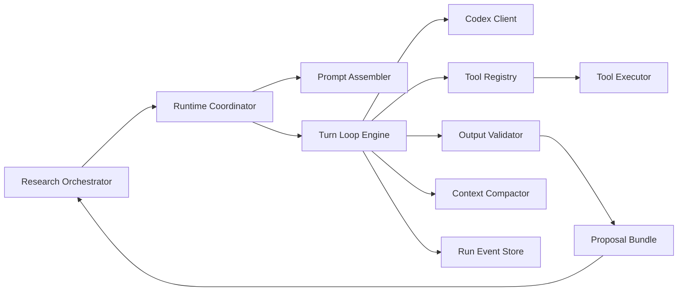
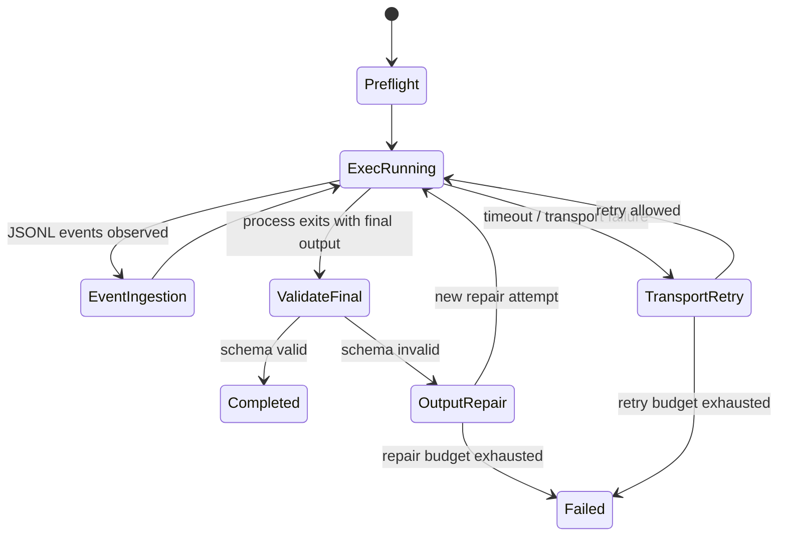

# Continual Research Bot Runtime Design

## 1. Goal

`RUNTIME.md`는 `DEE-12`의 첫 번째 축인 `Codex adapter runtime`을 구현 가능한 수준으로 닫는 문서다.
이 문서의 목적은 아래 세 가지다.

- Agents SDK 없이도 backend가 직접 agentic runtime을 운영할 수 있게 한다.
- `Codex adapter`를 state authority가 아닌 `execution substrate`로 제한한다.
- 이후 구현 이슈를 runtime, orchestrator, validation, persistence 단위로 분해할 수 있게 한다.

본 문서는 `tool registry`, `turn loop`, `structured output repair`, `context compaction`,
`retry / idempotency`, `failure boundary`를 구체적으로 정의한다.

## 2. Runtime Thesis

한 줄 요약:

`Backend owns the run state machine; Codex produces proposed actions; tools execute under backend control; persistence happens only after backend validation.`

핵심 설계 결정:

- v1 runtime의 표준 인터페이스는 `single run request -> single codex exec attempt stream -> validated proposal bundle`이다.
- Codex는 직접 graph를 수정하지 않는다.
- tool call은 항상 backend registry를 통해 검증, 승인, 실행된다.
- backend는 `codex exec --json` event stream과 최종 산출물을 자체 event log에 적재해 재개와 replay의 authority로 삼는다.
- final structured output은 단일 shot 성공을 가정하지 않고 `repairable contract`로 다룬다.

## 3. Runtime Boundaries

### 3.1 In Scope

- Codex prompt assembly
- tool schema registration and validation
- turn-by-turn tool dispatch
- tool result reinjection
- structured output validation and repair
- context budget enforcement
- runtime event logging
- resumable turn execution

### 3.2 Out Of Scope

- frontier selection policy 자체
- graph write adjudication policy 자체
- queue priority algorithm 자체
- auth credential acquisition 자체

이 문서에서 다루는 runtime은 orchestrator가 선택한 run plan을 실제로 실행하는 계층이다.

## 4. Module Boundary



모듈 책임:

- `Research Orchestrator`: frontier 선택, run intent 생성, 종료 판정
- `Runtime Coordinator`: run-level configuration, deadlines, budgets, resume orchestration
- `Prompt Assembler`: topic state를 execution context로 변환
- `Turn Loop Engine`: model turn, tool execution, reinjection, retry를 관리
- `Codex Client`: CLI 또는 향후 provider adapter를 통한 Codex 호출
- `Tool Registry`: tool manifest, schema, policy를 authoritative하게 보유
- `Tool Executor`: 실제 shell, web, MCP, internal service 호출 수행
- `Output Validator`: final schema 검증과 repair prompt 생성
- `Context Compactor`: token budget 초과 시 loss policy 적용
- `Run Event Store`: replay/resume용 append-only event ledger

### 4.1 Transport Decision

v1 primary execution transport는 `codex exec --json`으로 고정한다.

이 결정의 근거:

- OpenAI 공식 `Non-interactive mode` 문서는 `codex exec`를 scripts, CI, scheduled jobs용 경로로 직접 문서화한다.
- local CLI도 `codex exec`, `--json`, `--output-schema`, `-o`, `resume`, `-C`, `--add-dir`, `--sandbox`를 안정적인 top-level surface로 노출한다.
- 우리 v1 목표는 backend-owned orchestration + validated proposal bundle 생성이지, Codex 내부 thread protocol 전체를 product contract로 채택하는 것이 아니다.

`codex app-server`는 보조 경로로만 둔다.

- 공식 문서상 app-server는 richer session protocol과 streaming notifications를 제공한다.
- local CLI help에서는 여전히 `[experimental]`로 표시된다.
- protocol surface가 넓고 `thread/start`, `turn/start`, `thread/resume`, `account/read`, `config/read`까지 직접 다뤄야 하므로 v1 구현/운영 리스크가 크다.

따라서 v1 실행 계층은 아래처럼 나눈다.

- `execution transport`: `codex exec --json --output-schema`
- `verification/inspection transport`: loopback-only `codex app-server`

권장 실행 템플릿:

```text
codex exec \
  --json \
  --output-schema ./schemas/research_run_v1.json \
  -C <workspace_root> \
  --sandbox workspace-write \
  --add-dir <optional_extra_write_root> \
  -o <final_message_path> \
  "<serialized runtime prompt>"
```

요구사항별 판단:

| Requirement | `codex exec` | `codex app-server` | v1 decision |
| --- | --- | --- | --- |
| tool calling | yes, Codex 내부 agent loop가 수행하고 JSONL event로 관찰 가능 | yes, item/tool notifications로 더 직접적 | `exec` 채택 |
| runtime events | yes, `--json` event stream | yes, `turn/*` / `item/*` notifications | `exec` 채택 |
| structured final output | yes, `--output-schema` | 가능하지만 client가 protocol handling 필요 | `exec` 채택 |
| host-controlled multi-turn reinjection | 제한적 | yes, `turn/start` / `turn/steer` | v1에서는 product requirement에서 제외 |
| transport-level resume | 제한적, `codex exec resume` 존재 | yes, `thread/resume` | v1에서는 backend replay로 대체 |
| persisted history fidelity | CLI rollout files에 의존 | `thread/resume`가 제공되지만 persisted ThreadItems는 lossy | transport replay를 authority로 삼지 않음 |

이 문서의 중요한 수정 해석:

- 본 문서에서 말하는 `turn loop`, `tool result reinjection`, `resume`는 product runtime contract이지, v1 transport가 host-controlled turn API를 제공해야 한다는 뜻은 아니다.
- v1에서는 `codex exec`가 한 번의 run 안에서 내부적으로 tool loop를 수행하고, backend는 JSONL events와 final proposal bundle을 받아 자체 ledger에 기록한다.
- 실패 후 재개는 `app-server` thread restore가 아니라 backend가 보유한 `RunExecutionRequest`, artifact store, event ledger를 바탕으로 새 `codex exec`를 다시 시작하는 방식으로 구현한다.

### 4.2 Backend Loop Vs Codex Loop

v1에서 실제 loop ownership은 아래처럼 자른다.

backend가 소유하는 loop:

- `RunExecutionRequest` 조립
- allowed tool / sandbox / writable roots / schema path 결정
- `codex exec --json` 프로세스 시작
- JSONL event 수집, 정규화, 저장
- 종료 후 final output validation
- validation 실패 시 repair attempt를 위한 새 `codex exec` 재호출
- retry / idempotency / artifact persistence / fail-closed policy

Codex 내부 loop에 맡기는 것:

- 한 번의 `codex exec` 실행 안에서 발생하는 model turn progression
- tool selection
- tool result consumption과 다음 reasoning step 연결
- final answer 초안 생성

즉, v1의 backend runtime은 `host-controlled multi-turn session runtime`이 아니라
`exec attempt orchestrator + event ingester + validator`에 가깝다.

### 4.3 Future-Path Abstractions

아래 추상화는 문서에서 계속 쓰되, v1 implementation target으로 오해하면 안 된다.

- `turn loop`
- `tool result reinjection`
- `ModelTurn`, `ToolDispatch`, `Reinjection`
- `CodexTurnResponse`
- transport-level `thread/resume`

v1 해석:

- 위 용어는 backend가 관찰하고 검증해야 하는 logical stages를 설명한다.
- 실제 transport contract는 `codex exec` JSONL events + final message 파일이다.
- host가 직접 `turn/start`나 `turn/steer`를 호출하는 설계는 future `app-server` or custom harness path로 내린다.

## 5. Canonical Contracts

### 5.1 `RunExecutionRequest`

```json
{
  "run_id": "run_01",
  "topic_id": "topic_01",
  "mode": "interactive",
  "objective": "Re-evaluate the current best hypothesis for topic X",
  "plan": {
    "must_attack_current_best": true,
    "must_generate_challenger": true,
    "must_collect_support_and_challenge": true
  },
  "context_snapshot": {
    "topic_summary": "...",
    "current_best_hypotheses": [],
    "challenger_targets": [],
    "active_conflicts": [],
    "open_questions": [],
    "recent_provenance_digest": "sha256:...",
    "selected_queue_items": [],
    "queued_user_inputs": []
  },
  "tool_policy": {
    "allowed_tools": ["web.search", "web.fetch", "internal.graph_query"],
    "network_mode": "restricted",
    "sandbox_mode": "workspace-write"
  },
  "output_contract": {
    "schema_id": "research_run_v1",
    "max_repair_attempts": 2
  },
  "budgets": {
    "max_turns": 12,
    "max_tool_calls": 40,
    "max_runtime_seconds": 1800,
    "soft_input_tokens": 120000,
    "hard_input_tokens": 180000
  },
  "idempotency_key": "run.execute:run_01:v1"
}
```

### 5.2 `ProposalBundle`

runtime의 정상 종료 결과는 아래 shape를 만족해야 한다.

```json
{
  "summary_draft": "...",
  "evidence_candidates": [],
  "claims": [],
  "arguments": [],
  "challenger_hypotheses": [],
  "conflict_assessments": [],
  "revision_proposals": [],
  "next_actions": [],
  "execution_meta": {
    "turn_count": 0,
    "tool_call_count": 0,
    "compactions": 0,
    "repair_attempts": 0
  }
}
```

### 5.3 `RuntimeEvent`

모든 진행 상태는 append-only ledger로 남긴다.

```json
{
  "run_id": "run_01",
  "seq": 17,
  "event_type": "tool.completed",
  "turn_index": 3,
  "timestamp": "2026-04-19T11:00:00Z",
  "payload": {
    "tool_call_id": "call_08",
    "tool_name": "web.search",
    "result_digest": "sha256:..."
  }
}
```

## 6. Tool Registry Design

### 6.1 Registry Object Model

각 tool은 manifest 기반으로 등록한다.

```json
{
  "name": "web.search",
  "version": "1",
  "kind": "external_io",
  "description": "Search the public web for evidence gathering",
  "input_schema": {},
  "output_schema": {},
  "timeout_seconds": 30,
  "side_effect_level": "read_only",
  "idempotency_mode": "pure",
  "retry_policy": {
    "max_attempts": 2,
    "backoff": "exponential"
  },
  "permissions": {
    "network": true,
    "filesystem": false,
    "secrets": []
  }
}
```

필수 필드:

- `input_schema`
- `output_schema`
- `timeout_seconds`
- `side_effect_level`
- `idempotency_mode`
- `retry_policy`
- `permissions`

### 6.2 Tool Classes

- `pure_read`: 검색, 조회, 파일 read. 자동 재시도 가능.
- `cacheable_read`: 외부 결과지만 짧은 TTL 캐시 가능.
- `deterministic_write`: 동일 idempotency key로 중복 실행 방지 가능.
- `non_idempotent_write`: 외부 발행, email, irreversible mutation. v1 research runtime에서는 금지 또는 별도 human approval 필요.

### 6.3 Validation Rules

tool call은 아래 순서로 통과해야 한다.

1. tool name allowlist 확인
2. JSON schema validation
3. argument normalization
4. permission boundary 확인
5. idempotency / dedupe ledger 확인
6. timeout budget 확인

하나라도 실패하면 tool은 실행되지 않고, failure event를 Codex에 reinject한다.

## 7. Exec Attempt Lifecycle

### 7.1 Core V1 Algorithm

```text
prepare prompt context
start codex exec --json --output-schema
stream JSONL events from stdout
normalize and persist observed tool / reasoning / final-output events
wait for process exit
collect final message artifact
validate against output contract
if valid -> complete
if invalid -> start a new repair attempt with minimal repair prompt
if transport failed -> retry or fail based on retry policy
```

핵심 해석:

- tool dispatch와 reinjection은 v1에서 Codex 내부 execution loop에서 일어난다.
- backend는 그 과정을 JSONL events로 관찰하고 policy violation만 fail closed 한다.
- backend가 tool result를 새 turn에 직접 넣는 host-controlled multi-turn loop는 v1 범위 밖이다.

### 7.2 Logical Stage Model



### 7.3 Parallel Tool Calls

v1 정책:

- 같은 turn 안에서 `pure_read` tool call은 병렬 실행 가능
- 동일 resource key를 공유하는 write 계열은 직렬화
- Codex가 병렬 호출을 요청하더라도 backend가 safe subset만 병렬화

직렬화 key 예시:

- `graph.topic:<topic_id>`
- `external.source:<provider>:<resource_id>`
- `auth.session:<principal_id>`

## 8. Tool Result Reinjection

tool result는 raw output 전체를 다시 넣지 않는다.
reinjection payload는 `result envelope`로 정규화한다.

중요한 경계:

- v1에서는 이 `result envelope`가 backend -> Codex transport payload로 직접 전달되는 것이 아니다.
- Codex는 한 번의 `exec` attempt 안에서 자체 tool loop를 유지하고, backend는 동일한 envelope shape를 artifact/event ledger의 canonical form으로 저장한다.
- future host-controlled runtime이나 app-server path에서는 이 canonical envelope를 실제 reinjection payload로 재사용할 수 있다.

```json
{
  "tool_call_id": "call_08",
  "tool_name": "web.search",
  "status": "ok",
  "result": {
    "summary": "3 relevant sources found",
    "artifacts": [
      {
        "artifact_id": "src_01",
        "kind": "web_result",
        "title": "Official statement",
        "url": "https://example.com"
      }
    ],
    "truncated": false
  }
}
```

reinjection 규칙:

- `stdout`, HTML, large JSON은 artifact store에 저장하고 요약/handle만 context로 전달
- binary 결과는 digest와 metadata만 전달
- tool error는 에러 전문 대신 `class`, `message`, `retryable`, `hint`만 전달

이 설계가 필요한 이유:

- tool output을 그대로 누적하면 context budget이 급격히 무너진다.
- provenance는 artifact store에 남기고, reasoning context에는 digest만 남겨야 한다.

## 9. Structured Output Repair Loop

### 9.1 Why Repair Is First-Class

runtime은 final output이 처음부터 schema를 만족할 것이라 가정하지 않는다.
특히 연구 결과는 배열 중복, 누락 필드, enum drift, provenance 누락이 자주 발생한다.

### 9.2 Repair Pipeline

1. final candidate를 JSON parse
2. schema validation 실행
3. semantic validators 실행
4. failure list 생성
5. minimal repair prompt 구성
6. same turn lineage로 Codex 재호출
7. repair budget 초과 시 fail

### 9.3 Validator Layers

- `syntax validator`: JSON parse 가능 여부
- `schema validator`: required, enum, additionalProperties
- `semantic validator`: evidence id uniqueness, referenced artifact existence, canonical temporal scope shape, hypothesis ids consistency, supersede predecessor requirements
- `policy validator`: forbidden field, unsupported graph mutation, unresolved citation placeholder 금지

### 9.4 Repair Prompt Shape

repair prompt는 validator-safe `ProposalBundle` 규칙과 실패 목록만 제공한다.
규칙은 canonical `temporal_scope`, claim/evidence/argument reference 선언 순서,
snapshot/challenger hypothesis target, `supersede`의 `supersedes_hypothesis_id`,
그리고 follow-up `next_actions`가 같은 contract를 유지해야 한다는 내용을 포함한다.

```text
Your previous final output failed validation.
Return only corrected JSON.

Validator-safe ProposalBundle rules:
- Use canonical claim.temporal_scope values ...
- If revision_proposals[].action is "supersede", include supersedes_hypothesis_id ...

Violations:
- revision_proposals[1].action must be one of strengthen/weaken/retire/supersede
- evidence_candidates[0].source_url is missing
- claims[2] references unknown artifact_id src_99
```

repair 시 기존 전체 대화를 다시 길게 설명하지 않는다.
오직 validator-safe rule set, final candidate, violation set만 제공해 drift를 줄인다.

## 10. Context Compaction And Truncation

### 10.1 Context Layers

runtime prompt context는 아래 우선순위로 관리한다.

1. system constraints
2. run objective and plan
3. current best hypothesis summary
4. active conflict frontier
5. current turn tool results
6. recent turn transcript
7. deep history / archived evidence

### 10.2 Compaction Policy

soft budget 초과 시:

- old turn transcript를 `turn summary blocks`로 압축
- large tool results를 artifact digest reference로 교체
- resolved subthreads를 drop

hard budget 초과 시:

- archived evidence 본문 제거
- older reasoning transcript 제거
- unresolved conflict, current best hypothesis, pending tool results만 유지

절대 제거하면 안 되는 것:

- run objective
- must-do competition constraints
- unresolved final validation errors
- tool call ids와 artifact ids의 참조 무결성

### 10.3 Compaction Artifact

압축 결과도 event store에 저장한다.

```json
{
  "event_type": "context.compacted",
  "payload": {
    "dropped_turns": [1, 2, 3],
    "summary_artifact_id": "ctxsum_04",
    "token_savings_estimate": 28400
  }
}
```

## 11. Retry, Idempotency, And Failure Boundaries

### 11.1 Retry Matrix

| Failure type | Retry? | Owner | Notes |
| --- | --- | --- | --- |
| transient tool network error | yes | runtime | bounded exponential backoff |
| Codex transport timeout | yes | runtime | same turn retry with same idempotency key |
| malformed tool call arguments | no | model repair | reinject validation error |
| final schema validation failure | yes | model repair | max `output_contract.max_repair_attempts` |
| graph persistence failure after proposal bundle | yes | orchestrator | outside runtime boundary |
| auth expired | conditional | auth subsystem | only after refresh attempt succeeds |

### 11.2 Idempotency Keys

최소 단위:

- run-level: `run.execute:<run_id>:v<attempt>`
- turn-level: `run.turn:<run_id>:<turn_index>`
- tool-level: `run.tool:<run_id>:<turn_index>:<tool_call_id>`
- repair-level: `run.repair:<run_id>:<repair_index>`

idempotency 적용 규칙:

- 같은 `tool-level` key로 이미 성공한 read는 재실행 대신 cached result 재주입 가능
- write는 ledger 확인 후 duplicate rejection
- Codex model retry는 동일 turn key를 유지하되 `transport_attempt`만 증가

### 11.3 Failure Boundary

runtime은 아래까지 책임진다.

- Codex와 tool을 사용해 `validated proposal bundle` 생성
- 실행 중간 event ledger 유지
- 재개 가능한 최소 상태 보존

runtime이 책임지지 않는 것:

- proposal bundle의 epistemic correctness 최종 승인
- graph commit transaction
- queue retry scheduling
- auth secret issuance

## 12. Resume Strategy

resume는 `transport-native thread resume`가 아니라 `event ledger replay + compacted context restore + fresh codex exec attempt`로 수행한다.

resume 절차:

1. latest successful turn 찾기
2. unfinished tool call 확인
3. duplicate-safe tool만 자동 재개
4. last valid context snapshot 복원
5. 새로운 `codex exec` prompt에 `resume notice`와 미완료 작업만 전달

resume를 금지해야 하는 경우:

- non-idempotent write tool이 중간 상태로 남은 경우
- auth principal이 바뀐 경우
- output contract version이 바뀐 경우

## 13. Minimum Internal Interfaces

```text
RuntimeCoordinator.execute(request) -> RuntimeResult
PromptAssembler.build(request, resume_state?) -> PromptFrame
CodexExecClient.run(request, prompt_frame) -> ExecRunResult
ToolRegistry.resolve(tool_name) -> ToolDefinition
ToolEventNormalizer.normalize(raw_event) -> RuntimeEvent
OutputValidator.validate(bundle, schema_id) -> ValidationResult
ContextCompactor.compact(history, budget) -> CompactedHistory
RunEventStore.append(event) -> void
RunEventStore.replay(run_id) -> RuntimeReplayState
```

## 14. Implementation Order

1. `RunEventStore`와 `RuntimeEvent` schema부터 구현
2. `ToolRegistry`와 manifest validation 구현
3. 단일 `codex exec --json` attempt ingestion + final output collection 구현
4. final output validator + repair loop 구현
5. context compaction 구현
6. resume/replay 구현
7. 병렬 tool dispatch와 advanced failure handling 추가

이 순서를 권장하는 이유:

- event ledger 없이는 resume와 failure analysis가 불안정하다.
- tool registry contract 없이 prompt/runtime loop를 먼저 만들면 tool drift가 발생한다.
- repair loop 없이 graph write layer를 붙이면 invalid proposal이 persistence 경계까지 올라간다.

## 15. Open Questions Left For Future Tasks

- tool-level cost budgeting을 runtime에서 직접 차감할지, orchestrator가 할지
- multi-agent challenger generation을 v2에서 runtime primitive로 올릴지
- streaming intermediate UI를 interactive 모드에서 어디까지 노출할지
- tool result ranking / dedupe를 model 바깥 deterministic layer로 얼마나 이동할지

## 16. References

- OpenAI Codex authentication docs: `https://developers.openai.com/codex/auth`
- OpenAI Codex non-interactive docs: `https://developers.openai.com/codex/noninteractive`
- OpenAI Codex web overview: `https://developers.openai.com/codex/cloud`
- OpenClaw OAuth concepts: `https://github.com/openclaw/openclaw/blob/main/docs/concepts/oauth.md`
- OpenClaw model provider hooks: `https://github.com/openclaw/openclaw/blob/main/docs/concepts/model-providers.md`
