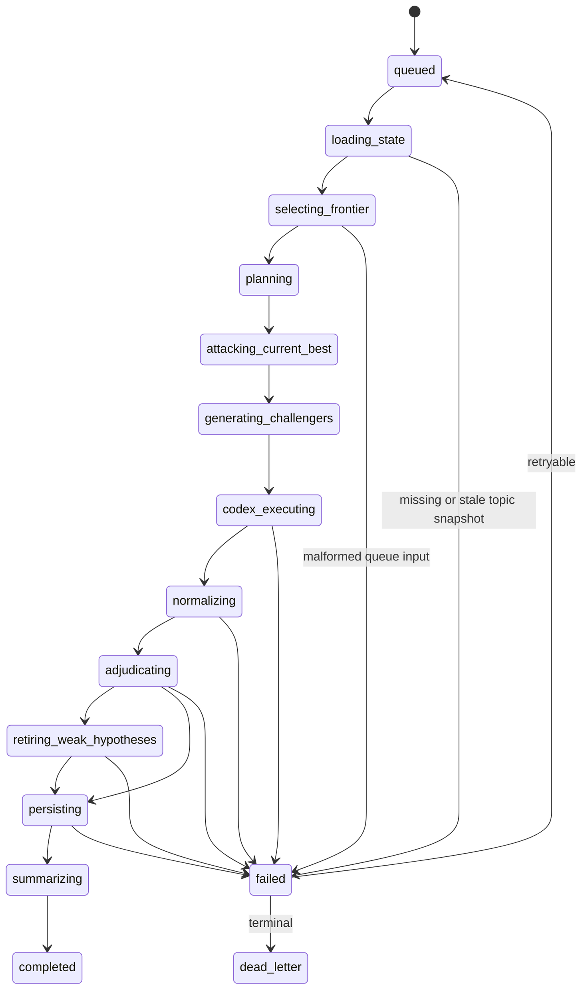

# Phase 3 Orchestrator State Machine

`DEE-25` fixes the backend-owned boundary before any runtime call:

1. claim a queue item through the relational ledger
2. load the latest persisted topic snapshot
3. reject missing, stale, malformed, or non-attackable snapshots before runtime execution
4. build the frontier selection input and `RunExecutionRequest`
5. advance the persisted run state to `codex_executing`
6. reject runtime proposals that omit the minimum competition loop

The executable transition map is `STATE_TRANSITIONS` in
`src/codex_continual_research_bot/orchestrator.py`.

## Snapshot Read Model

`topic_snapshots` stores strict `TopicSnapshot` payloads by
`(topic_id, snapshot_version)`. The orchestrator reads only the latest snapshot.
The persisted row key must match the payload's `topic_id` and
`snapshot_version`; mismatches are treated as malformed backend state rather
than silently trusting the JSON body.
If a caller supplies `expected_snapshot_version` and the latest version differs,
the run transitions to `failed` and no runtime request is returned. Snapshots
must also contain at least one current-best hypothesis so the run has an
attack target before runtime starts.
Resume uses the `runs.snapshot_version` recorded when the run first reached
frontier selection, so replay does not drift to a newer topic snapshot. Runs
that have not pinned a snapshot yet are not runtime-resumable. Runtime resume
is limited to `codex_executing`; once a proposal advances the run to
`normalizing`, the backend must continue the downstream validation/persistence
path instead of rebuilding a fresh Codex execution request.

## Intent Builder

The run intent builder maps the claimed queue row into:

- `FrontierSelectionInput`
- `RunExecutionRequest.context_snapshot.selected_queue_items`
- `RunExecutionRequest.objective`
- `RunExecutionRequest.idempotency_key`

Persisted queue payload JSON must validate against the canonical `QueuePayload`
contract, and `selected_queue_item_ids` must include the claimed queue item.
Persisted queue row fields used in the request, including `kind` and
`idempotency_key`, must also validate before a runtime intent is returned.
The builder fails closed instead of silently repairing or ignoring queue
authority mismatches.

All generated requests set the Phase 3 competition requirements:

- `must_attack_current_best`
- `must_generate_challenger`
- `must_collect_support_and_challenge`

## Proposal Gate

Before later phases may normalize or persist runtime output,
`accept_competition_proposal(...)` validates the runtime proposal and only then
advances the run from `codex_executing` to `normalizing`. Its validation path
first checks that the persisted run still matches the supplied intent's topic,
queue item, idempotency key, and snapshot version, then
requires:

- support and challenge arguments for each current-best target
- competition arguments must reference declared claims
- a challenge argument targeting each current-best target
- at least one challenger hypothesis
- either active-conflict reconciliation/escalation or weaken/retire/supersede
  pressure on a snapshot-relevant hypothesis
